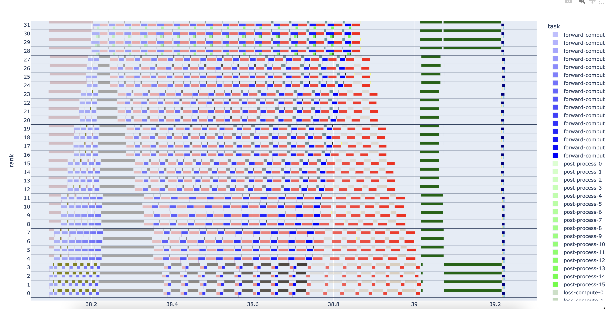

## Run modified Megatron-LM


### 1. 환경 정보

- host os: centos 7.9
- nodes: 1 ~ 16 EA
- gpus: NVIDIA RTX3090(24GB), NVIDIA A10(22GB), NVIDIA A100(40GB)
- cpu: intel xeon gold
- memory: 756 GB
- slurm version: 20.11.4
- enroot version: 3.4.0
- container image: `nvcr.io/nvidia/pytorch:23.04-py3`

### 2. git clone 
```bash
git clone http://manycore.uos.ac.kr:19518/deagwon/tdpp.git
workdir=`pwd`/tdpp
```

### 3. gitignore 데이터 준비
gitlab에 올라가지 않은 데이터 혹은 폴더를 추가로 생성해야 합니다.

### 3.1. log dir 생성
```bash
cd $workdir
mkdir -p log
mkdir -p log-ncu
mkdir -p log-nsys
mkdir -p log2
```

### 3.2. 데이터 준비
아래 링크에서 text_document for gpt2 small 데이터와 text_document for gpt2 xl 데이터를 아래 링크에서 다운 받고 `tdpp/small`, `tdpp/xl` 경로에 업로드합니다.

https://drive.google.com/drive/folders/1ib7y1pchIhfpMkGU6DoqwGDA5JQNw4pP?usp=drive_link


```
tdpp
├── small # text_document for gpt2 small
│   ├── my-gpt2_text_document_train_indexmap_1600ns_1024sl_1234s_doc_idx.npy
│   ├── my-gpt2_text_document_train_indexmap_1600ns_1024sl_1234s_sample_idx.npy
│   └── my-gpt2_text_document_train_indexmap_1600ns_1024sl_1234s_shuffle_idx.npy
└── xl    # text_document for gpt2 xl
    ├── my-gpt2_text_document_train_indexmap_1600ns_1024sl_1234s_doc_idx.npy
    ├── my-gpt2_text_document_train_indexmap_1600ns_1024sl_1234s_sample_idx.npy
    ├── my-gpt2_text_document_train_indexmap_1600ns_1024sl_1234s_shuffle_idx.npy
    ├── my-gpt2_text_document_train_indexmap_3200ns_1024sl_1234s_doc_idx.npy
    ├── my-gpt2_text_document_train_indexmap_3200ns_1024sl_1234s_sample_idx.npy
    └── my-gpt2_text_document_train_indexmap_3200ns_1024sl_1234s_shuffle_idx.npy
```

### 4. 실행 설정
아래서 언급하는 파일들은 모두 `tdpp/Megatron-LM-2` 폴더에 위치합니다.

#### 4.1. _00conf.sh 수정

 실험과 관련된 모든 설정을 담고 있습니다. __00conf.sh 는 이후에 사용되는 여러 스크립트에서 참조하며 실험의 모든 설정을 컨트롤합니다. 단, sbatch 스크립트는 일부 설정을 동적으로 결정할 수 없기 때문에 따로 수정해야합니다. 

```bash
.
.
.
HOMOGENEOUS_CLUSTER=true # true | false
MODEL='xl' # 'small' or 'xl'
NPROC_PER_NODE=4 # 노드당 gpu 수
NNODES=8 # 실행 노드 수
WORLD_SIZE=$((NPROC_PER_NODE * NNODES))
GLOBAL_BATCH_SIZE=64
MICRO_BATCH_SIZE=1
TENSOR_MP_SIZE=1
DP_SIZE=4
PIPELINE_MP_SIZE=8
PARTITION="0-11-8-8-8-8-5-0"
NSYS=false # nsight systems 프로파일 실행 유무
PROFILE=false # 자체 프로파일러 시각화를 위한 설정 적용 유무 (_05_report_visualization.py 실행을 위해서는 필요함.)
MASTER_PORT=6787 
RELOAD_CONTAINER=false # 컨테이너 환경 재사용 유무
```

#### 4.2. _02_*_job.sh 수정
`_02_hetero_master_job.sh`, `_02_hetero_slave_job.sh`,`_02_homo_job.sh` 스크립트는 각각 동종 혹은 이기종 작업을 슬럼으로 제출하는 sbatch 스크립트입니다. 
1.  `#sbatch --` 인자 수정  
이 스크립트에는 `#sbatch --` 로 시작하는 라인이 존재하며, 슬럼과 관련된 설정은 여기서 수정해야 합니다. 주로 노드 수, 파티션, gpu수를 결정합니다.

2. `srun GRES` 인자 수정  
`srun` 의 `gres` 인자 또한 sbatch 인자와 동일하게 수정해야 합니다.

3. 이기종 job 설정 주의사항  
이기 종의 경우, master job과 slave job이 구분됩니다. slave job의 경우 `MASTER_ADDR` 인자를 추가로 전달해야 합니다. 
이기종의 경우 nodes 수를 주의해서 수정해야 합니다. 만약 총 16개의 노드를 사용하면서, 1개의 master node 15개의 slave 노드로 구성되어 있다면, mater_job.sh 파일에서는 nodes값이 1, slave_job.sh 파일에서는 nodes 값이 15가 되어야 합니다.

```bash
#SBATCH --nodes=8
#SBATCH --partition=gpu2
#SBATCH --gres=gpu:a10:4
...
#************************************************************
GRES="gpu:a10:4"
. _00_conf.sh
#************************************************************
...
# get_master_adress
MASTER_ADDR='192.168.120.60'
...
```

### 5. 실행
준비가 끝났다면, 다음 명령어를 통해서 job을 제출합니다.
```bash
cd $workdir/Megatron-LM-2/
./_03_submit.sh
```

### 6. 진행상황 확인
`get_result.sh` 스크립트 진행상황을 확인합니다. 이 스크립트를 통해서 각 노드마다 실행되는 job의 stdout, stderr, gpu 사용현황을 실시간으로 모니터링할 수 있습니다. 또한 일부 정보를 파싱하여 job의 전체적인 설정을 다시 보여줍니다. 사용자가 원하는 설정이 적절히 적용되었는지 다시 확인할 수 있습니다. 

다음 항목을 통해서 job의 상태를 판단할 수 있습니다.
1. slrum status
가장 기본적으로 `sacct -u $user`명령어가 말해주는 job의 상태가 running이 아니라면 종료된 job 입니다.

2. job이 실행중 이더라도 gpu 에 어떤 프로세스도 할당되지 않았다면 job이 동작하지 않는 것으로 판단합니다.

3. std err에 warngin 이외의 다른 error 메시지가 존재한다면 해당 job에 이상이 있는 것으로 판단합니다.

4. job info 에서 출력되는 결과와 _00_conf.sh 파일의 값이 다르다면 job에 이상이 있는 것으로 판단합니다.


```bash
./get_result.sh <jobid>
```

```
******************* last output message *******************
../log2/10932251/n060.out  ../log2/10932251/n063.out  ../log2/10932251/n066.out
../log2/10932251/n061.out  ../log2/10932251/n064.out  ../log2/10932251/n067.out
../log2/10932251/n062.out  ../log2/10932251/n065.out
==> ../log2/10932251/n060.out <==
[before the start of training step] datetime: 2023-06-14 16:08:12 
[Rank 0] (after 20 iterations) memory (MB) | allocated: 1570.77001953125 | max 
...
[Rank 24] (after 20 iterations) memory (MB) | allocated: 3035.10107421875 | max allocated: 3869.255859375 | reserved: 4020.0 | max reserved: 4020.0

==> ../log2/10932251/n067.out <==
 iteration       30/      50 | consumed samples:         1920 | elapsed time per iteration (ms): 1423.8 | learning rate: 7.031E-07 | global batch size:    64 | lm loss: 1.017721E+01 | loss scale: 262144.0 | grad norm: 16.666 | number of skipped iterations:   0 | number of nan iterations:   0 |
 iteration       40/      50 | consumed samples:         2560 | elapsed time per iteration (ms): 1373.9 | learning rate: 1.172E-06 | global batch size:    64 | lm loss: 9.237929E+00 | loss scale: 262144.0 | grad norm: 5.335 | number of skipped iterations:   0 | number of nan iterations:   0 |
 iteration       50/      50 | consumed samples:         3200 | elapsed time per iteration (ms): 1409.8 | learning rate: 1.641E-06 | global batch size:    64 | lm loss: 8.917599E+00 | loss scale: 262144.0 | grad norm: 2.932 | number of skipped iterations:   0 | number of nan iterations:   0 |
1548 lines..
******************* last error message *******************
../log2/10932251/n060.err  ../log2/10932251/n063.err  ../log2/10932251/n066.err
../log2/10932251/n061.err  ../log2/10932251/n064.err  ../log2/10932251/n067.err
../log2/10932251/n062.err  ../log2/10932251/n065.err
==> ../log2/10932251/n060.err <==
  warnings.warn(

...

==> ../log2/10932251/n067.err <==
  warnings.warn(
301 lines..
******************* last gpu message *******************
../log2/10932251/n060.gpu  ../log2/10932251/n063.gpu  ../log2/10932251/n066.gpu
../log2/10932251/n061.gpu  ../log2/10932251/n064.gpu  ../log2/10932251/n067.gpu
../log2/10932251/n062.gpu  ../log2/10932251/n065.gpu
==> ../log2/10932251/n060.gpu <==
[0] NVIDIA A10       | 49'C,   0 % |     0 / 22731 MB |
[1] NVIDIA A10       | 50'C,   0 % |     0 / 22731 MB |
[2] NVIDIA A10       | 49'C,   0 % |     0 / 22731 MB |
[3] NVIDIA A10       | 48'C,   0 % |     0 / 22731 MB |

==> ../log2/10932251/n067.gpu <==
[0] NVIDIA A10       | 50'C,   0 % |     0 / 22731 MB |
[1] NVIDIA A10       | 51'C,   0 % |     0 / 22731 MB |
[2] NVIDIA A10       | 48'C,   0 % |     0 / 22731 MB |
[3] NVIDIA A10       | 49'C,   0 % |     0 / 22731 MB |
5040 lines..
******************* job info 10932251 *******************
items: n060.err n060.gpu n060.out n061.err n061.gpu n061.out n062.err n062.gpu n062.out n063.err n063.gpu n063.out n064.err n064.gpu n064.out n065.err n065.gpu n065.out n066.err n066.gpu n066.out n067.err n067.gpu n067.out
NODE_RANK: 1
MASTER_ADDR: 192.168.120.70
NNODES: 8
WORLD_SIZE: 32
GLOBAL_BATCH_SIZE: 64
MICRO_BATCH_SIZE: 1
TENSOR_MP_SIZE: 1
DP_SIZE: 4
PIPELINE_MP_SIZE: 8
PARTITION: 0-11-8-8-8-8-5-0
MODEL: xl
HIDDEN_SIZE: 1600
NUM_LAYERS: 48
PROFILE: false
******************* iteration time *******************
iteration 10 : 4.5416 s
iteration 20 : 1.4015 s
iteration 30 : 1.4238 s
iteration 40 : 1.3739 s
iteration 50 : 1.4098 s
debug?  : 0
```


### 7. job 실험 결과의 시각화
마지막으로 job 실험결과를 시각화 할 수 있습니다.
`_05_report_visualization.py`를 사용하며 이 파이썬 스크립트의 최상단에 몇 가지 값을 수정하여 원하는 job의 실험결과를 수정합니다.

#### requirement
```
pip install pandas plotly matplotlib numpy tqdm 
```

```python
#%%
jobid='10931852' # slurm job id
nodeid='n065'    # 관찰할 노드의 id입니다. ls ../log2/job id 명령어로 어떤 노드들에서 job이 실행됐는지 확인 할 수 있습니다. 한번에 한 노드의 결과만 시각화 할 수 있습니다.
f = open(f"../log2/{jobid}/{nodeid}.out", "r")
lines = f.readlines()
world_size = 32
dp_dim = 4
num_iter = 10 # log를 기록하는 interation 간격 수 입니다. 기본값 10을 사용합니다.
df_list = []

```

다른 커맨드로 `_05_report_visualization.py`를 실행하면 out.html 파일이 생성되며 이 파일을 다운받아 크롬 브라우져로 실행하면 시각화된 결과물을 확인할 수 있습니다.
```bash
./_05_report_visualization.py
```



### 8. 소스맵

```bash
.
├── FASOP # 최적 분할 탐색 알고리즘
│   ├── amp_utils.py
│   ├── estimate.py
│   ├── FASOP_1.5b.py
│   ├── FASOP_345m.py
│   ├── FASOP_pareto.py
│   ├── known_cost
│   ├── main_logs
│   ├── pipe.py
│   └── stage.py
├── image # megatron 실행 환경 이미지
│   ├── nvcr.io+nvidia+pytorch+23.03-py3.sqsh
│   └── readme.md
├── log  .. # megatron log
├── log2 .. # slurm log
├── log-ncu .. # nsight compute log
├── log-nsys ..# nsight systems log
├── Megatron-LM-2
│   ├── _00_conf.sh  # 모델 크기, 분할 방법, 프로파일링 여부 결정
│   ├── _00_pretrain_gpt.py # megatron 실행 python 스크립트
│   ├── _01_run_inter.sh # conf 파일을 읽어서 megatron 실행하는 스크립트
│   ├── _02_hetero_master_job.sh # 이기종 gpu 클러스터에 slurm sbatch 스크립트
│   ├── _02_hetero_slave_job.sh # 이기종 gpu 클러스터에 slurm sbatch 스크립트
│   ├── _02_homo_job.sh # 동종 gpu 클러스터에 slurm sbatch 스크립트
│   ├── _03_submit.sh # 제출 스크립트
│   ├── _04_report.sh # job의 실행 결과 리포팅 스크립트
│   ├── _05_report_visualization.py # job 실험 결과를 시각화 하는 스크립트
│   ├──get_result.sh # job 제출 및 실행 현황 모니터링 스크립트
.   .
├── README.md
├── small # text_document for gpt2 small
│   ├── my-gpt2_text_document_train_indexmap_1600ns_1024sl_1234s_doc_idx.npy
│   ├── my-gpt2_text_document_train_indexmap_1600ns_1024sl_1234s_sample_idx.npy
│   └── my-gpt2_text_document_train_indexmap_1600ns_1024sl_1234s_shuffle_idx.npy
└── xl    # text_document for gpt2 xl
    ├── my-gpt2_text_document_train_indexmap_1600ns_1024sl_1234s_doc_idx.npy
    ├── my-gpt2_text_document_train_indexmap_1600ns_1024sl_1234s_sample_idx.npy
    ├── my-gpt2_text_document_train_indexmap_1600ns_1024sl_1234s_shuffle_idx.npy
    ├── my-gpt2_text_document_train_indexmap_3200ns_1024sl_1234s_doc_idx.npy
    ├── my-gpt2_text_document_train_indexmap_3200ns_1024sl_1234s_sample_idx.npy
    └── my-gpt2_text_document_train_indexmap_3200ns_1024sl_1234s_shuffle_idx.npy
```