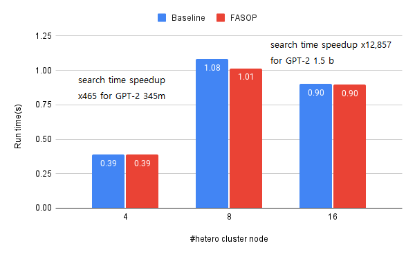
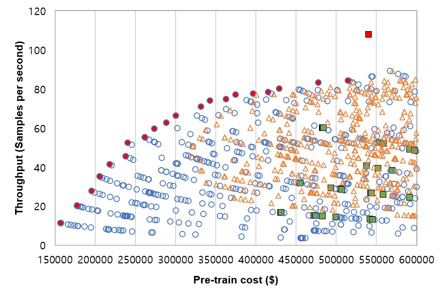

# FASOP: Fast yet Accurate Automatic Search for Optimal Parallelization of a Transformer on Heterogeneous GPU Clusters(ICPP 2023)

This repository contains FASOP, a framework that automates the process of finding the optimal degrees of parallelism and model partitioning for Transformer-based models on heterogeneous GPU clusters. FASOP accurately estimates pipelining latency and GPU communications, enabling it to find configurations that minimize the cost of GPU clusters while satisfying training time constraints, or configurations that minimize training time while meeting cost constraints. FASOP supports a variety of Transformer-based models and uses advanced algorithms and techniques to rapidly and accurately estimate device configurations.

-----

# Performance

## search time for the optimal partitioning

FASOP offers fast and efficient model partitioning for Transformer-based models on heterogeneous GPU clusters. With advanced algorithms and techniques, FASOP can rapidly estimate and find optimal model partitioning configurations that minimize training time while meeting cost constraints. Additionally, FASOP can find similar configurations that closely match the optimal configuration.
**Please note that lower values indicate better performance.**

<p align="center">

</p>

## Real-World Applications
Using advanced algorithms and techniques, FASOP can rapidly find optimal device configurations in virtual AWS environments. The Pareto chart below shows the optimal trade-off between estimated training cost and throughput for different GPU clusters, including clusters with A10 GPU nodes, heterogeneous GPU clusters, and clusters with A100 GPU nodes.

<p align="center">

</p>

# Usage

(1) Finding Optimal Parallel Strategy for GPT on Heterogeneous GPU Clusters.
(2) As results of FASOP, you can launch practical distributed learning using Megatron-LM.

## Reproducing the Experiments from [FASOP: Fast yet Accurate Automatic Search for Optimal Parallelization of a Transformer on Heterogeneous GPU Clusters]

To reproduce the experiments from [FASOP: Fast yet Accurate Automatic Search for Optimal Parallelization of a Transformer on Heterogeneous GPU Clusters], follow these steps:

### 1. Install the necessary dependencies for FASOP. 

- FASOP requires a CPU for estimation tasks.
- We recommend to create conda environment for test of reproducibility.
- Python 3.8+, PyTorch 1.7+, CUDA 11.0+, numpy 

    ```bash
    cd ~/workspace
    git clone https://github.com/{git_id}/FASOP
    conda create -name fasop python=3.8
    conda activate fasop
    conda install numpy ninja pyyaml mkl mkl-include setuptools cmake cffi typing_extensions future six requests
    pip install tqdm spur torch==1.7.1+cu110 torchvision==0.8.2+cu110 -f https://download.pytorch.org/whl/torch_stable.html
    ```
<!-- TODO: pytorch version, Python version test? -->

### II. Reproducing Experiment 4.1: Finding Optimal Parallel Strategy for GPT on Heterogeneous GPU Clusters
To reproduce Experiment 4.1, which involves finding the optimal parallel strategy for the GPT 3.5m model and 1.5b on heterogeneous GPU clusters, follow the steps below. The python codes should be located in the 'FASOP' directory of the FASOP repository. 
- To reproduce GPT-2 345m experiment, run `FASOP_345m.py`.
    ```bash
    python FASOP_345m.py
    ```
- To reproduce GPT-2 1.5b experiment, run `FASOP_1.5b.py`.
    ```bash
    python FASOP_1.5b.py
    ```
To reproduce Experiment 4.2, which involves finding the optimal parallel strategy for the GPT 1.5b model on virtual AWS cluster.
 - To reproduce Experiment 4.2, run `FASOP_pareto.py`.
    ```bash
    python FASOP_pareto.py
    ```
Find the results of the experiment. FASOP will output a summary of the optimal parallel strategy for your model on your heterogeneous GPU cluster, including any estimated training time, cost, and other relevant metrics, in a text file. The name of the text file will be `gpt345m.txt`, `gpt1.5b.txt`, and `pareto.txt` located at `~/workspace/FASOP/FASOP/main_logs`, repectively.
The results file will contain the following fields, separated by ('\*'):
`rank`, `mbs`, `tp degree`, `dp degree`, `pp degree`, `node_info`, `partition`, `estimated_time`, `pipeline time`, `time of DP`, `time of reducing embedding layers`, `$/step`.
    
<!-- TODO: write output log-->


## Run modified Megatron-LM

### I. setup

- `$HOME/tdpp` 경로에 tdpp 폴더를 위치시킵니다.
- `$HOME/tdpp/image/megatron-latest.sqsh` 경로에 `megatron-latest.sqsh` 파일을 위치시킵니다.
- `$HOME/tdpp/Megatron-LM-2/log2` 경로에 `log2` 폴더를 생성합니다.
- `$HOME/tdpp/Megatron-LM-2/log` 경로에 `log` 폴더를 생성합니다.

#### Prepare Wikipedia Training Dataset
Download Wikipedia data: https://dumps.wikimedia.org/enwiki/latest/enwiki-latest-pages-articles.xml.bz2
then extract the text with https://github.com/attardi/wikiextractor

### II. run
#### 1. run by sbatch

sbatch.sh 파일과 run_inter.sh 파일을 수정한 후 sbatch 커맨드를 통해서 job을 실행합니다.

- `$HOME/tdpp/Megatron-LM-2/sbatch.sh` 파일을 적절히 수정합니다.
    ```bash
    #!/bin/bash
    #SBATCH --nodes=4
    #SBATCH --ntasks-per-node=1
    #SBATCH --partition=gpu2
    #SBATCH --nodelist=n063,n064,n065,n066
    #SBATCH --gres=gpu:a10:4,gpu:a10:4,gpu:a10:4,gpu:a10:4
    #SBATCH --cpus-per-task=28
    #SBATCH -o ./log2/%j.sbatch.%N.out         # STDOUT
    #SBATCH -e ./log2/%j.sbatch.%N.err         # STDERR
    ```

- `$HOME/tdpp/Megatron-LM-2/run-inter.sh` 파일을 적절히 수정합니다.
    ```bash
    #!/bin/bash
    NODE_RANK=$1
    MASTER_ADDR=$2
    NPROC_PER_NODE=4
    NNODES=4
    WORLD_SIZE=$((NPROC_PER_NODE * NNODES))

    MICRO_BATCH_DIM=1
    TENSOR_MP_SIZE=1
    PIPELINE_MP_SIZE=4
    DP_SIZE=$((WORLD_SIZE/PIPELINE_MP_SIZE/TENSOR_MP_SIZE))

    GLOBAL_BATCH_SIZE=$((32*MICRO_BATCH_DIM))
    MICRO_BATCH_SIZE=$((GLOBAL_BATCH_SIZE/DP_SIZE/MICRO_BATCH_DIM/PIPELINE_MP_SIZE))
    ```

- `sbatch`
    ```bash
    $ sbatch sbatch.sh
    ```
#### 2. run by srun
`srun` 커맨드를 통해서 개별 노드에 직접 접속하여 job을 실행할 수 있습니다.

```bash
PARTITION=gpu2
GRES=gpu:a10:4
NODE=n062
NODE_RANK=0
MASTER_ADDR=

srun --cpus-per-task 28 -p $PARTITION --nodelist $NODE --gres=$GRES --pty bash
container_path="/scratch/enroot/$UID/data/megatron-latest"
test -d $container_path && 
    rm -rf $container_path
enroot create $HOME/tdpp/image/megatron-latest.sqsh
SCRIPT_NAME='run_inter.sh'
enroot start --root \
            --rw \
            -m $HOME/tdpp/Megatron-LM:/root/Megatron-LM megatron-latest \
            bash -c "cd /root/Megatron-LM/ &&\
                    sh $SCRIPT_NAME $NODE_RANK $MASTER_ADDR"
```

### III. report

실행 로그는 다음 경로에 저장됩니다.
- sbatch 로그: `$HOME/tdpp/Megatron-LM-2/log2/JOBID.sbatch.NODE.out, err`
- srun 로그: `$HOME/tdpp/Megatron-LM-2/log2/JOBID/NODE.out, err`
- gpu 사용량 로그: `$HOME/tdpp/Megatron-LM-2/log2/JOBID/NODE-gpu.log`

job을 실행한 후 다음 명령어를 통해서 gpu 사용량, 노드별 std out 등을 확인할 수 있습니다.

```bash
tail -f $HOME/tdpp/Megatron-LM-2/log2/JOBID/NODE.out
tail -f $HOME/tdpp/Megatron-LM-2/log2/JOBID/NODE-gpu.log
```


### IV. Profile with Torch Profiler

아래 경로에서 training.py가 오리지널 파일인지, torch profiler가 작동하는 파일인지 확인합니다.

Megatron-LM-2/megatron/

메가트론을 실행합니다.
프로그램이 종료되면 Megatron-LM-2/log/ 경로에 생성된 로그파일들을 텐서보드를 사용해 확인합니다.
생성된 파일들 중에 마스터 노드에서 실행된 파일 딱 하나만 다른 경로(예:temp)로 옮겨 확인해야 distributed 탭을 확인 가능합니다.
```bash
tensorboard --logdir=./log/temp --bind_all
```

이미 생성된 log파일들은 아래 경로에 rank 별로 존재합니다.

`/home/soonyear/profile/12_A10-4_RTX3090/`

먼저 computation 시간과 communication 시간을 확인합니다. 확인은 Normal - view - Distributed 에서 확인 가능합니다.
두번째로는 TP comm.시간과 DP comm.시간을 확인합니다. 확인은 trace에서 가능합니다.
자세한 방법은 문의하세요.


### V. Profile layer by layer execution time

레이어별 연산시간 프로파일링은 AMP의 재료로 사용하기 위해 필요합니다.
1. 먼저 `Megatron-LM-2/megatron/` 경로로 이동합니다.
2. 기존 training.py를 삭제하고 training-profile_LBL.py를 training.py로 변경합니다.
3. 메가트론을 실행합니다. 실행 파일은 `LayerByLayer_profile.sh` 입니다. 연산시간은 마스터노드에서 리스트 형태로 출력됩니다.

## References
<a id="1">[1]</a> 
- Li, Dacheng, et al. "AMP: Automatically Finding Model Parallel Strategies with Heterogeneity Awareness." arXiv preprint arXiv:2210.07297 (2022). [the paper link](https://arxiv.org/abs/2210.07297)

<a id="2">[2]</a> 
- Narayanan, Deepak, et al. "Efficient large-scale language model training on gpu clusters using megatron-lm." Proceedings of the International Conference for High Performance Computing, Networking, Storage and Analysis. 2021. [the paper link](https://dl.acm.org/doi/abs/10.1145/3458817.3476209)

<a id="2">[3]</a> 
@misc{Wikiextractor2015,
  author = {Giusepppe Attardi},
  title = {WikiExtractor},
  year = {2015},
  publisher = {GitHub},
  journal = {GitHub repository},
  howpublished = {\url{https://github.com/attardi/wikiextractor}}
}

<!-- anonymous라서 contact는 지움-->